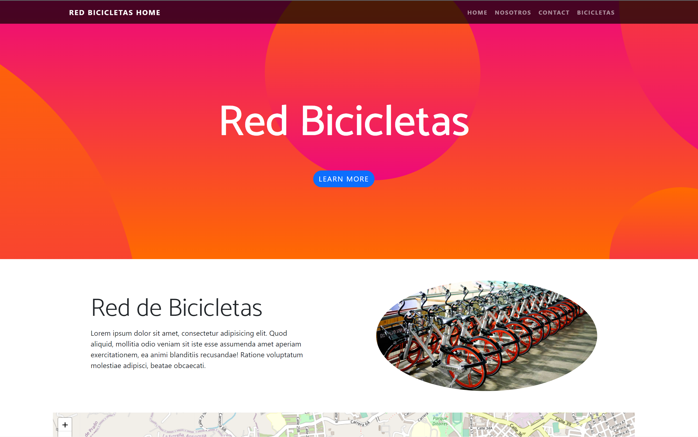

# 🚲 Bicycle Network 🚲
This is an application to rent bikes using nodejs and express. You can run the application with  docker or using npm. 
## Getting started

1. git clone the repository
2. Enter folder: `cd <repository>`
4. Install dependencies: `npm install`
5. Start application: `npm start`
6. Visit [http://localhost:3000](http://localhost:3000) in your browser

## Docker

The easiest way to get up and this application running is using Docker. Once the Docker CLI is installed from [https://www.docker.com/get-docker](https://www.docker.com/get-docker).

1. You can use the docker image [alismo1013/red-bici](https://hub.docker.com/r/alismo1013/red-bici)

## Application

### Home page

### Bikes page

### Bikes creation page

